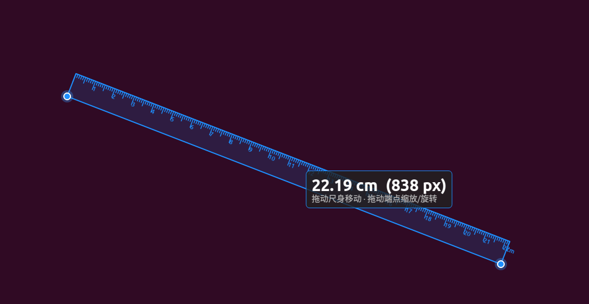

# 屏幕量角器 / 尺子 — Linux 移植版



> **Forked from:** [kingsimba/screen-ruler-protractor](https://github.com/kingsimba/screen-ruler-protractor)
> （原版是 WPF / .NET 6 的 Windows 版本 — 见 [上游 README](https://github.com/kingsimba/screen-ruler-protractor#readme) 和 [上游 workflow](https://github.com/kingsimba/screen-ruler-protractor/blob/master/.github/workflows/dotnet-desktop.yml)）
>
> 本项目是面向 **Ubuntu 20.04** 的 **PyQt5 + X11 移植版**。
> 与 WPF 版本不共享代码 — 功能相同，技术栈不同。
> 状态文件格式与 Windows 版兼容，跨平台挂载同一个 `state.json` 即可让两个版本共用。

WPF 版屏幕量角器 / 尺子的 PyQt5 + X11 移植，目标平台 **Ubuntu 20.04 (X11)**。

功能上与 Windows 版等价：透明全屏覆盖层、仅在控制点处接受点击的穿透逻辑、带两条射线和角度弧的量角器、带 mm/cm 刻度的尺子、系统托盘图标、状态持久化。

## 架构

```
.
├── main.py                 QApplication 入口（薄启动器）
│
├── src/screen_ruler/       包本体 — 唯一存放实现的位置
│   ├── geometry.py         纯 Python 数学（Vec、angle、point_in_polygon、hysteresis）
│   ├── state.py            XDG 配置 + 原子写入的 JSON（文件格式与 WPF 版兼容）
│   ├── platform_x11.py     唯一接触 X11 的模块：光标 + XFixes input shape
│   │                       + 显示器 / DPI 查询（Qt 优先，xrandr 兜底）
│   ├── protractor.py       量角器：状态 + QPainter 绘制（不碰 Xlib）
│   ├── ruler.py            尺子：状态 + QPainter 绘制 + hysteresis（不碰 Xlib）
│   ├── overlay.py          主 QWidget：全屏透明窗口、命中测试轮询、
│   │                       拖拽处理、点击穿透切换（调用 platform_x11）
│   └── tray.py             QSystemTrayIcon，运行时绘制 32×32 量角器图标
│
├── tests/                  unittest 测试集
│   ├── test_geometry.py    单元测试（无需显示器）
│   ├── test_state.py       单元测试（无需显示器）
│   └── smoke_test.py       全栈绘制测试（需要 Xvfb）
│
├── .github/workflows/      CI（ubuntu-20.04 + xvfb）
├── README.md
├── CHANGELOG.md
├── LICENSE                 MIT
└── .gitignore
```

分层严格：`ruler` 和 `protractor` 只 import `geometry`，完全不碰 X11。这就为将来替换成 `platform_wayland.py` 留好了门 — 只需保持同样的公共接口（`cursor_pos`、`set_input_passthrough`、`virtual_screen_geom`、`dip_per_cm_at`）。

## 依赖

Ubuntu 20.04 自带所有依赖：

| 包                       | 20.04 上的版本 | 说明                                       |
|--------------------------|----------------|--------------------------------------------|
| `python3`                | 3.8.10         | 系统 Python                                |
| `python3-pyqt5`          | 5.14.1         | Qt 5 widgets + QPainter                    |
| `python3-xlib`           | 0.33           | X11 协议，只用于读取光标位置               |
| `libxfixes-dev`          | 1:5.0.3-2      | XFixes input shape（点击穿透）             |
| `libxrandr`              | 1.5.2          | 显示器几何信息的兜底                       |
| `xrandr`                 | 任意           | DPI 兜底用的 CLI                           |
| `xvfb`                   | 2:1.20.13      | 仅 smoke test 需要                         |

**不需要 `pip install` 任何东西。** 上述所有包在装了 `python3-pyqt5` 的标准 Ubuntu 20.04 桌面上都已预装。验证一下：

```bash
python3 -c "import PyQt5.QtWidgets, Xlib; print('OK')"
```

## 运行

```bash
# 从仓库根目录运行
python3 main.py
```

覆盖层会全屏显示，托盘图标出现在系统托盘区，默认是点击穿透的。把鼠标移到控制点（橙 / 蓝圆点）附近，覆盖层就会开始接受输入，可以拖动。

右键任一控制点可弹出上下文菜单，双击托盘图标可显示 / 隐藏覆盖层。

## 状态文件

```text
$XDG_CONFIG_HOME/screen-protractor/state.json
   （默认：~/.config/screen-protractor/state.json）
```

字段定义与 WPF 版的 `%AppData%\ScreenProtractor\state.json` 一致，跨平台挂载同一份文件即可让两个版本共用状态。

## 测试

```bash
# 单元测试 — 不需要显示器
python3 -m unittest discover -t . -s tests -p "test_*.py" -v

# 烟雾测试 — 需要 X server，用 Xvfb
xvfb-run -a python3 -m unittest discover -t . -s tests -p "smoke_test.py" -v
```

`-t .`（top-level dir）这个参数让仓库内的 `src/screen_ruler` 包在测试里直接可 import，不需要 `pip install -e .`。`main.py` 和 `tests/__init__.py` 在被直接调用时也会做同样的事。

烟雾测试覆盖：
1. 导入所有模块（捕获 X11 路径上的 `ImportError`）
2. `state.save` → `state.load` 的往返
3. 构造 `OverlayWindow`，resize / show 后 `render()` 到 `QPixmap`。断言量角器绘制有非透明像素，切到尺子模式后也有

## 与 WPF 版相比的已知限制

- **廉价显示器的物理厘米标定。** 如果 `xrandr` 报 `0mm × 0mm`（EDID 缺失的面板），尺子会回退到像素模式。WPF 版用 `GetDpiForMonitor(MDT_RAW_DPI)` 拿到的值更接近面板真实密度，这两种读数在低端显示器上可能差几个百分点。
- **点击穿透的边界情况。** 部分 X11 合成器（mutter、某些对焦模式下的 KWin）在窗口移动时会重新转换 input shape；我们用客户端相对矩形来尽量规避，但如果你在快速拖拽后看到覆盖层突然开始抢点击，就是这个原因。
- **GNOME 上的托盘图标。** GNOME 不装 `appindicator` 扩展就不显示 StatusNotifierItem 图标：
  ```bash
  sudo apt install gnome-shell-extension-appindicator
  ```
- **X11 透明。** 我们靠 `WA_TranslucentBackground` 不画背景实现透明。如果某个合成器拒绝对空 surface 做 alpha 混合，把 `overlay.paintEvent` 里那行注释打开，改成 `p.fillRect(self.rect(), QColor(0, 0, 0, 1))`（WPF 版用的 1-alpha 技巧）。

## 故障排查

| 现象                                       | 可能原因                                  |
|--------------------------------------------|-------------------------------------------|
| `libXfixes.so.3: cannot open shared object file` | 缺 `libxfixes-dev`                       |
| `qt.qpa.xcb: could not connect to display`       | 用 `xvfb-run` 跑（或接到真实显示器）     |
| GNOME 上看不到托盘图标                          | 装 `gnome-shell-extension-appindicator`  |
| `import Xlib` 失败                              | `sudo apt install python3-xlib`          |
| 尺子显示 "px" 而不是 "cm"                       | 显示器 EDID 缺失，补一下或更新            |
